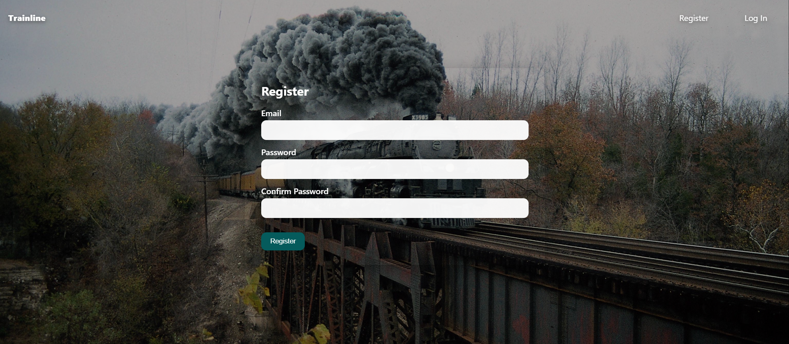
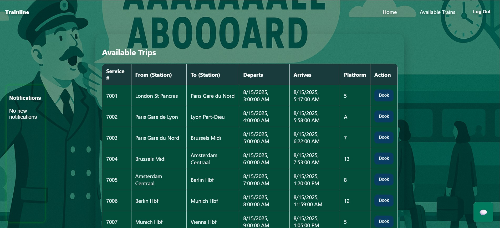
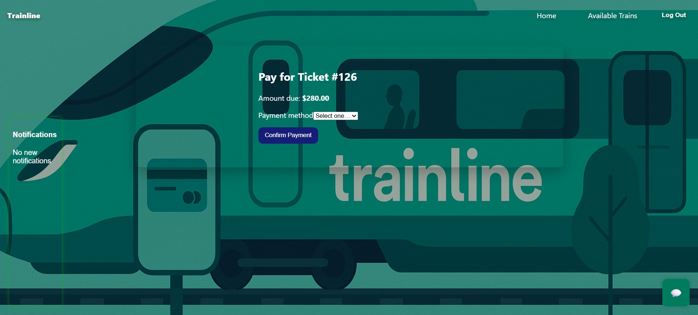

# 🚆 Trainline 


## Demo


---


## Overview
Trainline is a full-stack project built with **Django (backend)**, **React (frontend)**, and **MySQL (database)**.  
It allows users to register, log in, browse train trips, book tickets, select seats, and make payments.  
This project was built independently for a **Database Systems class** to demonstrate DBMS concepts and relational design.

---

## Features
-  User Authentication (Register/Login)
-  Browse and book train trips
-  Ticket + Seat selection
-  Payment system
-  Notifications widget
-  Chat widget

---

## Screenshots






## Relational Schema
| Table             | Key Fields                        | Relationships                                |
|-------------------|-----------------------------------|----------------------------------------------|
| **User**          | user_id (PK), email, password     | One-to-many with Tickets                     |
| **Ticket**        | ticket_id (PK), user_id (FK)      | Many-to-many with Passenger (via bridge)     |
| **Passenger**     | passenger_id (PK), name           | Linked to Ticket via Ticket_Passenger        |
| **Flight/Train**  | flight_id (PK), route, time       | One-to-many with Tickets                     |
| **Payment**       | payment_id (PK), ticket_id (FK)   | One-to-one with Ticket                       |
| **Notifications** | notif_id (PK), user_id (FK)       | One-to-many with User                        |

---

##  Tech Stack
- **Frontend**: React (JSX, CSS)
- **Backend**: Django (REST Framework)
- **Database**: MySQL
- **Other**: JWT Authentication, Axios

---

## Setup & Installation
### Backend
```bash
cd backend
pip install -r requirements.txt
python manage.py migrate
python manage.py runserver
```

### Frontend
```bash
cd frontend
npm install
npm start
```

---

## Credits
- Built for **CSCI 3321 - Database Systems & potential employers for insight on improvement**
- Thanks a lot to **Dr. Weitian Tong** for succint teaching with good sources of practice via website 

---

## License
This project is licensed under the [MIT License](LICENSE).
