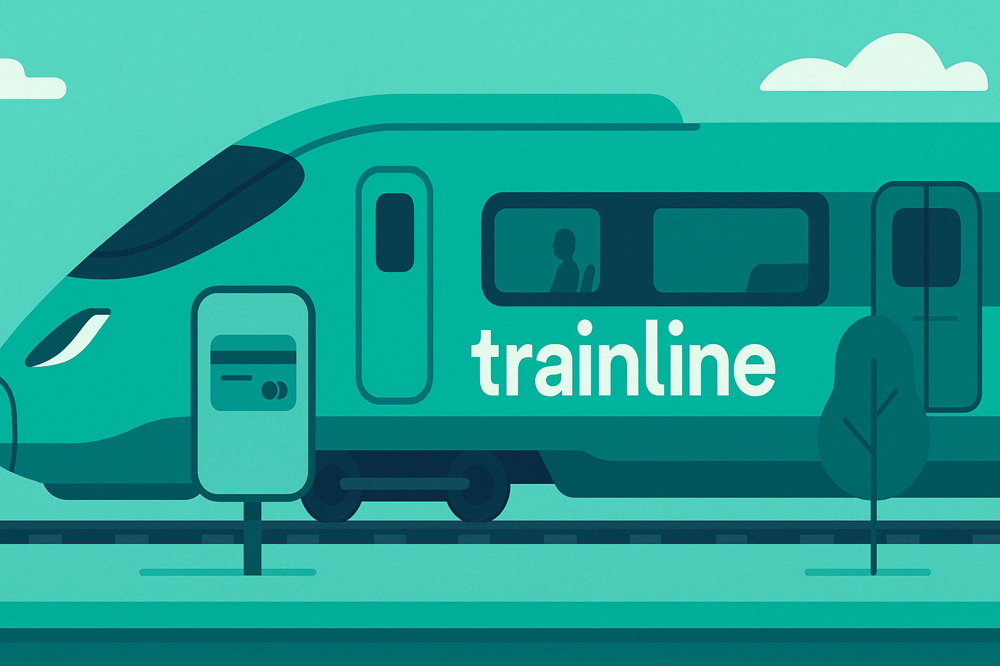

# 🚆 Trainline - Django + React + MySQL

[]()
[]()
[]()

## 📖 Overview
Trainline is a **full-stack train booking system** built with **Django (backend)**, **React (frontend)**, and **MySQL (database)**.  
It was developed as part of my **Database Systems class (Spring 2025)**, where I explored **relational schema design** and how DBMS integrates with modern full-stack development.  

The project features **authentication, trip browsing, booking, payments, notifications, and chat widgets**, all powered by a relational database backend.

---

## ✨ Features
- 🔑 Secure user authentication (register & login)
- 🚄 Browse available train trips
- 🎟️ Ticket booking with seat selection
- 💳 Integrated payment workflow
- 🔔 Notifications for updates
- 💬 Chat widget for user interactions

---

## 🖼️ Screenshots




---

## 🎥 Demo


---

## 🗄️ Relational Schema
| Table             | Key Fields                        | Relationships                                |
|-------------------|-----------------------------------|----------------------------------------------|
| **User**          | user_id (PK), email, password     | One-to-many with Tickets & Notifications     |
| **Ticket**        | ticket_id (PK), user_id (FK)      | Many-to-many with Passenger (via bridge)     |
| **Passenger**     | passenger_id (PK), name           | Linked to Ticket via Ticket_Passenger        |
| **Flight/Train**  | flight_id (PK), route, time       | One-to-many with Tickets                     |
| **Payment**       | payment_id (PK), ticket_id (FK)   | One-to-one with Ticket                       |
| **Notifications** | notif_id (PK), user_id (FK)       | One-to-many with User                        |
| **ChatBox**       | chat_id (PK), user_id (FK)        | One-to-many with User                        |

---

## ⚙️ Tech Stack
- **Frontend**: React (JSX, CSS)
- **Backend**: Django REST Framework
- **Database**: MySQL
- **Other**: JWT Authentication, Axios, REST API

---

## 🚀 Setup & Installation
### Backend
```bash
cd backend
pip install -r requirements.txt
python manage.py migrate
python manage.py runserver
```

### Frontend
```bash
cd frontend
npm install
npm start
```

---

## 🙏 Credits
- Built independently by **Hamza** for **CSCI 3321 - Database Systems**
- Guided by **Dr. Weitian Tong**

---

## 📜 License
This project is licensed under the [MIT License](LICENSE).
